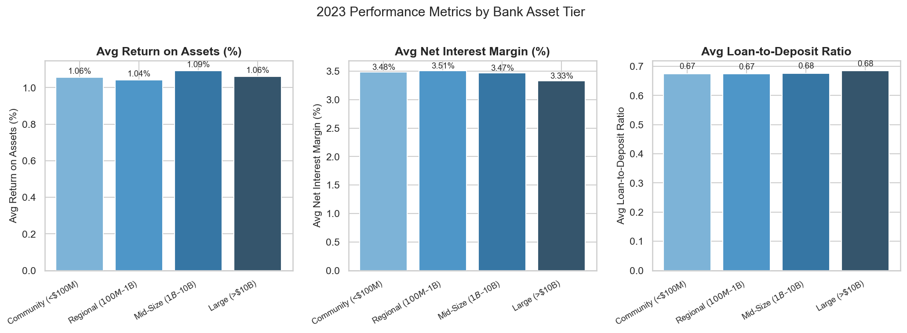
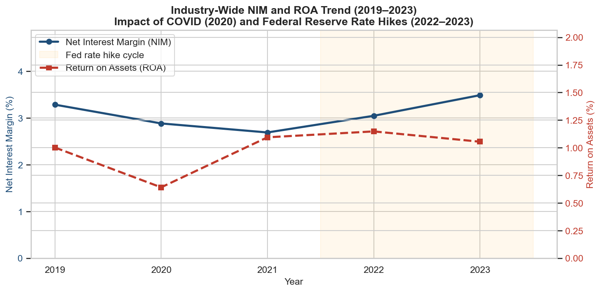
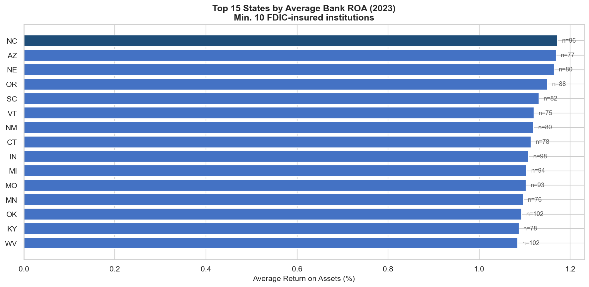

# U.S. Bank Financial Health Analysis

**Python · SQL · FDIC Public Data · Data Visualization**

Analysis of FDIC call report data across ~4,500 U.S. commercial banks (2019–2023),
identifying performance patterns by asset tier, geographic concentration, and stress signals
across the COVID downturn and Federal Reserve rate hike cycle.

---

## Key Questions

1. How do ROA, NIM, and loan-to-deposit ratios differ across bank size tiers?
2. How did net interest margins respond to the 2022–2023 Fed rate hikes?
3. Which states have the highest concentration of profitable institutions?
4. Which banks show stress signals — negative ROA and elevated loan-to-deposit ratios?
5. Who are the top performers within each asset tier? *(SQL window functions)*

---

## Charts

**Performance by Asset Tier (2023)**


**NIM and ROA Trend 2019–2023**


**Top States by Average ROA (2023)**


---

## How It Works

```
01_fetch_data.py        Pull FDIC API → SQLite (real data)
02_analyze.py           SQL queries + visualizations
sql/queries.sql         Standalone SQL reference
generate_sample_data.py Synthetic data for testing (no API needed)
```

**Python** handles data acquisition (FDIC REST API), loading into SQLite, and visualization.
**SQL** drives all analytical queries via `pd.read_sql_query()` — the database does the work.

---

## SQL Techniques Demonstrated

| Query | Technique |
|---|---|
| Performance by tier | `CASE WHEN` classification, `GROUP BY`, computed ratio |
| NIM/ROA trend | Multi-year aggregation, time-series grouping |
| State rankings | `JOIN` across tables, `HAVING` filter |
| Stress signals | Multi-condition `WHERE`, `NULLIF` for safe division |
| Tier rankings | `RANK() OVER (PARTITION BY ...)` window function, CTE |

---

## Data Source

[FDIC BankFind Suite](https://banks.fdic.gov/) — public API, no authentication required.

Key fields: `ASSET` (total assets), `ROA` (return on assets), `ROE` (return on equity),
`NIM` (net interest margin), `LNLSNET` (net loans), `DEP` (total deposits), `NETINC` (net income).

All monetary values stored in thousands of dollars (FDIC convention).

---

## Setup

```bash
pip install -r requirements.txt

# Option A: real FDIC data (requires internet, takes ~2 min)
python 01_fetch_data.py

# Option B: synthetic data for testing (instant)
python generate_sample_data.py

# Run the analysis
python 02_analyze.py
```

Charts are saved to `output/`. The SQLite database (`bank_data.db`) is gitignored.
